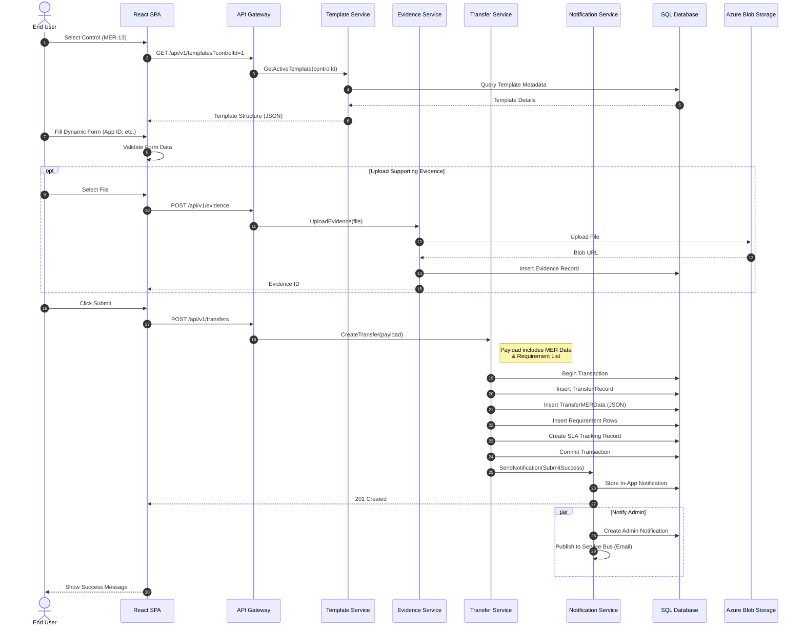
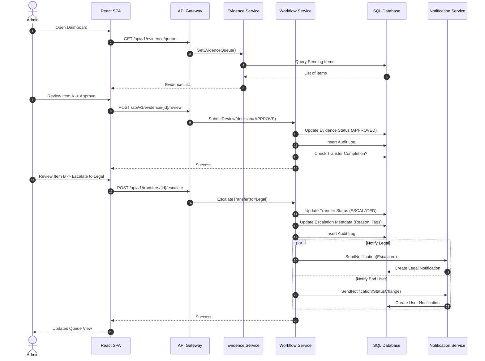
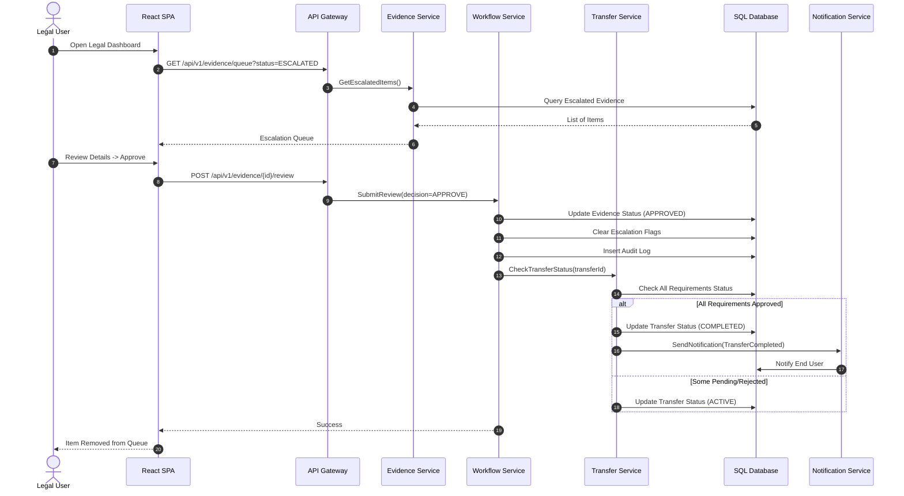

# Central Inventory - Sequence Diagrams

## 1. End User Submission Workflow (MER)

This diagram illustrates the flow when an End User fills out an MER template, uploads evidence, and submits a transfer request.

---

## 2. Admin Review & Escalation Workflow

This diagram shows an Admin reviewing an item from the queue, deciding to approve one evidence and escalate another to Legal.

---

## 3. Legal Review & Completion Workflow

This diagram flow shows a Legal user finding an escalated item, reviewing it, and marking it as complete.

